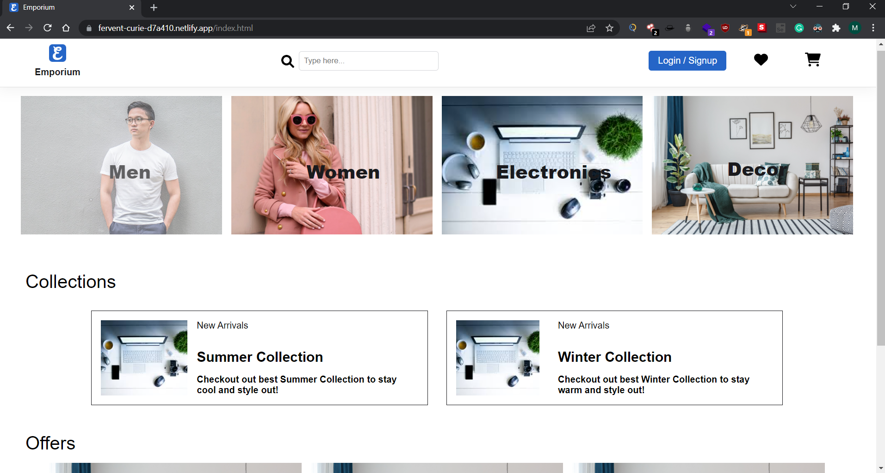
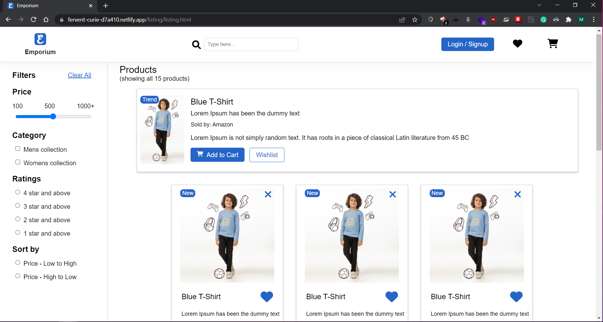
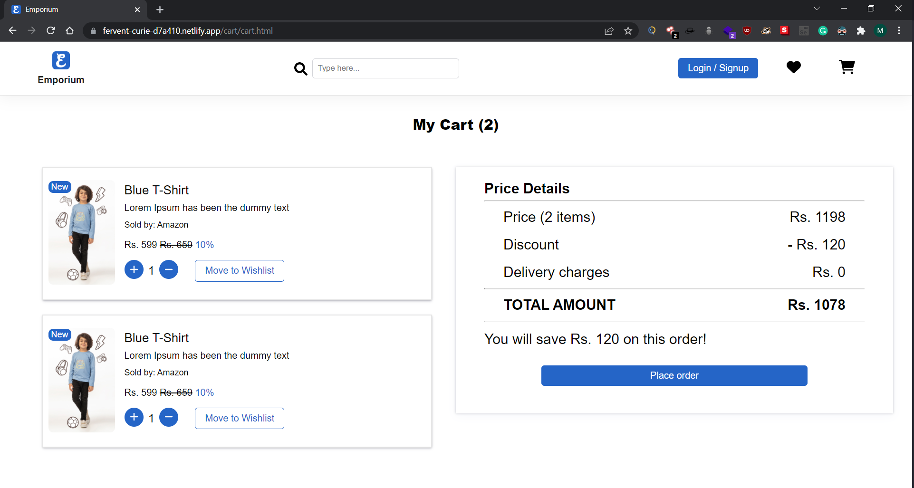
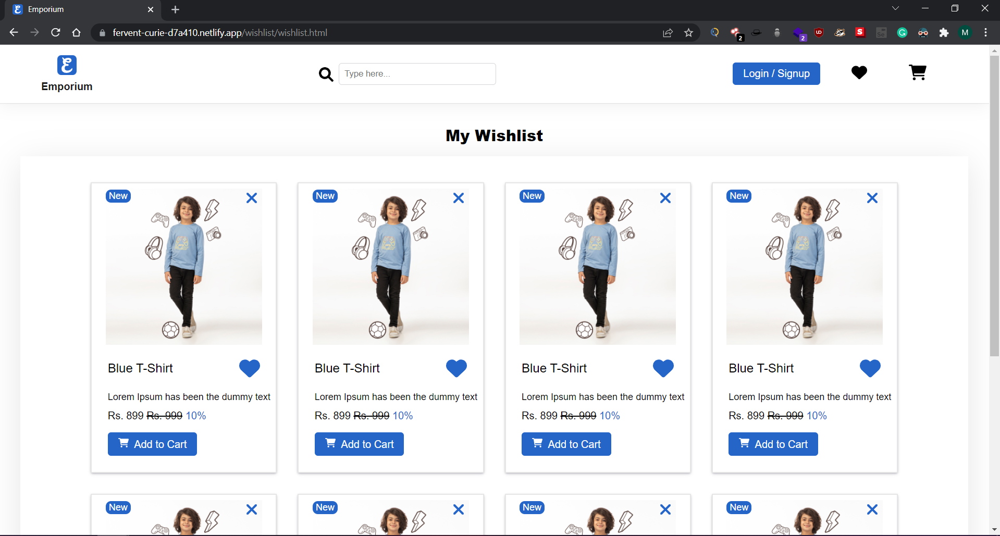
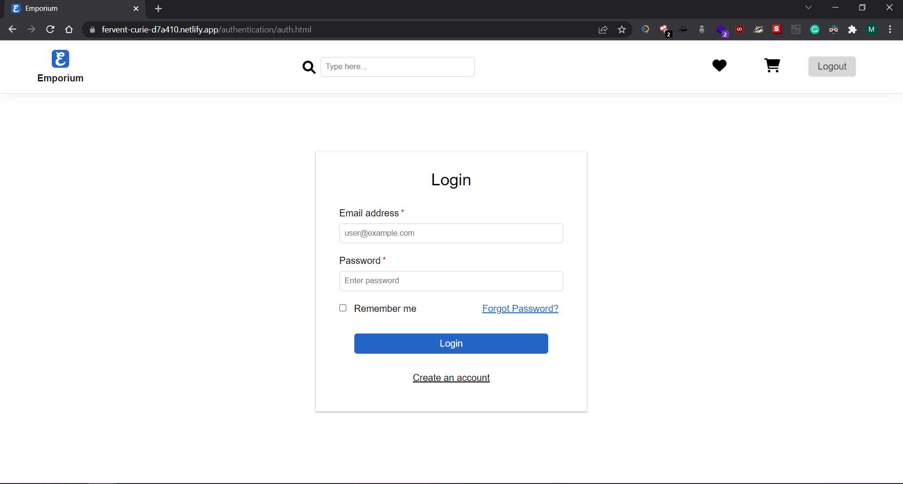
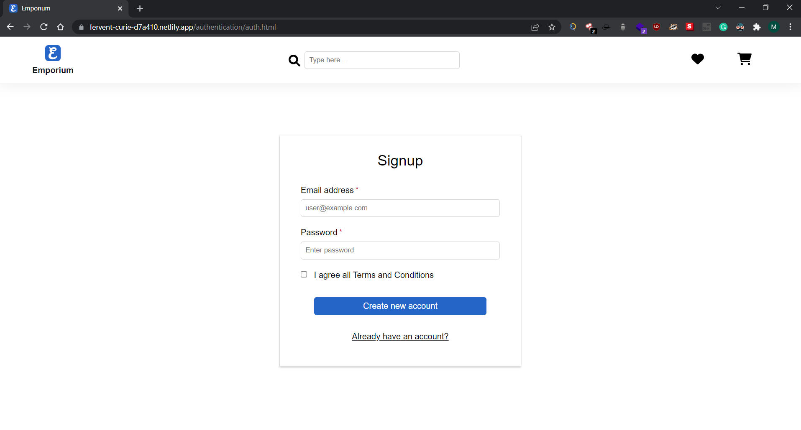

# Emporium - Ecommerce store built using Zippy-UI

Live link: 

---

Pages and what Components are used from Zippy-UI:

---

1. Homepage:

Components: 
- Buttons and Icons on Navbar
- All Images on Website
- Text content (size, weight)

---

2. Product Listing page with Filters

Components: 
- Horizontal Trending card with Badge
- Vertical Cards with Wishlist and Dismiss Buttons
- Vertical Cards without Badge
- Silder for Price
- Text content (weight, size)
- Clear All (underline) Button

---

3. Cart Page

Components: 
- Horizontal Card
- Order Button
- Text content (size, weight)

---

4. Wishlist Page

Components: 
- Vertical Cards with Badge and Dismiss Button
- Text content (size, weight)

---

5. Login Page

Components: 
- Inputs with label
- Login Button
- Logout (secondary) Button
- Text content (size, weight)

---

6. Signup Page

Components: 
- Inputs with label
- Create an Account Button
- Text content (size, weight)

---